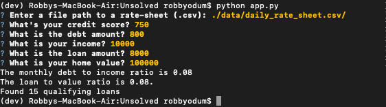

# loan_qualifier
This application determines what banks the user would qualify for a loan at based on the user input criteria of credit score, income, debt amount, loan amount requested, and home value. The bank information is called from the daily rate sheet csv file.

---

## Technologies

This application is written in Python v. 3.9.7 and uses the following libraries:

[pathlib](https://docs.python.org/3/library/pathlib.html) was used to successfully import the daily rate sheet csv file into app.py 

[fire](https://pypi.org/project/fire/) was used for CLI

[questionary](https://questionary.readthedocs.io/en/stable/index.html) was used to prompt the user for the input criteria

[csv](https://docs.python.org/3/library/csv.html) was used to call the daily rate sheet csv

---

## Installation Guide

Prior to running this application, perform the following in the command line to install the required libraries:

**pip install fire**

**pip install questionary**

---

## Usage

In order to launch the application, type into the command line:

```python 
Python app.py
```

The user will then be prompted to input the file path to the csv containing the bank data, i.e. the daily rate sheet file. Next, the user will be prompted to input their credit score, debt amount, income, loan amount, and home value. Following these entries, the program will output the monthly debt to income ratio, the loan to value ratio, and the number of qualifying loans found given the criteria.

Here is an example of input criteria and the resulting output of the application:



---

## Contributors

Robby Odum, Email: rodum012@gmail.com

---

## License

MIT
